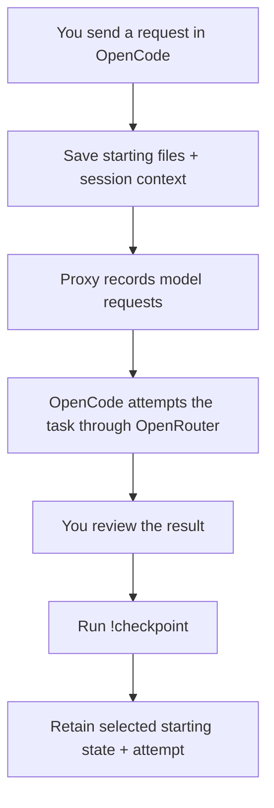
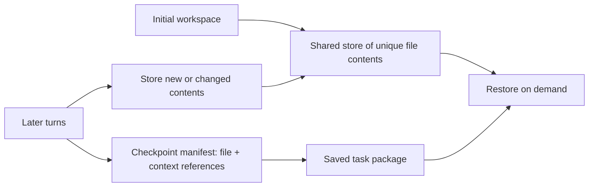
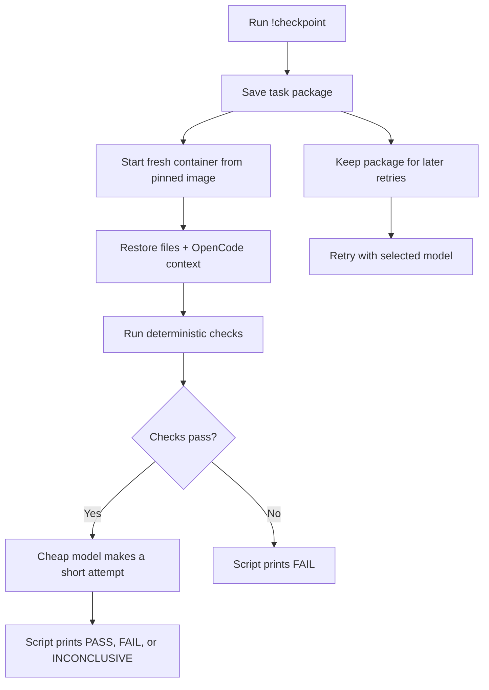
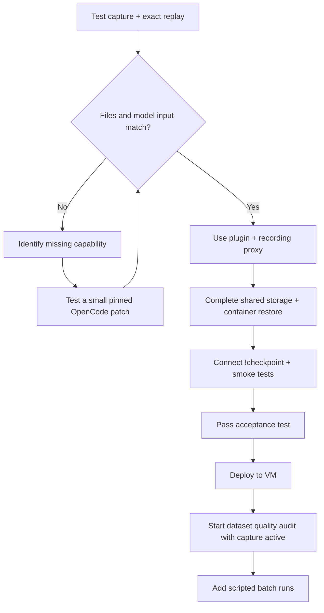

# MVP design draft

## Project purpose

Create reproducible reinforcement learning (RL) environments from model attempts on routine software tasks. The harness is the software that captures task state, restores it, and runs evaluation. OpenCode is the interactive coding agent. OpenRouter provides access to the models.

During an OpenCode session, the harness automatically records the workspace and effective model input before each user request. The user runs `!checkpoint` to retain a selected attempt as a task package. The package supports repeated evaluation and, after reward validation, RL training.

The first application is a quality audit of Xiaomi’s public MiMo-V2.6 RL task dataset. The audit compares task instructions with evaluation logic to identify ambiguous requirements, incorrect rewards, and incomplete checks. OpenCode will assist with this work while capture is active. Failures in those coding sessions can become new RL task candidates. [Dataset](https://huggingface.co/datasets/XiaomiMiMo/MiMo-V2.6-RL-oss)

A captured attempt is not a validated RL task. Each task requires a success check that correctly accepts valid solutions and rejects invalid solutions.

**Editable review document.** This file can be revised. Technical evidence and implementation history belong in `agent-log.md`, which is append only.

## Writing rules

- Use precise technical terms and short, direct sentences. Follow ASD-STE100 principles where practical: one instruction per sentence, explicit subjects, and consistent terms. Define abbreviations and avoid unexplained project references. This document does not claim formal ASD-STE100 compliance.
- Start each section with its decision or purpose.
- Use diagrams for distinct workflows. Use compact tables for options and checks.
- State what is agreed, proposed, or still unverified.
- Give each build step an output and a pass condition so the next phase is clear.
- Keep the main document brief. Put detailed research, debugging, and test evidence in the agent log.
- Revise this document as decisions change. Do not rewrite the agent log.

**Current phase:** Complete Step 2 against the [frozen acceptance requirements](docs/step-2-requirements.md). Implementation is underway. No new acceptance conditions may be added without user approval.

## Capture and daily use

Capture is automatic. A user turn consists of one request and the resulting agent attempt. 

`!checkpoint` selects the most recent user request by default. An explicit selector can identify an earlier request. The command retains the pre-request state and the attempt log. The command itself is excluded from task selection. The failed attempt is evidence; it is not included in the restored starting context.

## Shared storage

The proposed store identifies file contents by cryptographic hash. A manifest maps file paths and metadata to stored contents. Unchanged files reuse the same stored object. Context and request records use the same deduplication principle. Storage grows with unique changes and retained context. No automatic deletion is planned.

## Checkpoint confirmation and retry

The script prints a fixed status message. The smoke test checks whether the runtime and agent execution path operate. The low-cost model does not need to solve the task. Its attempt is stored in the logs.

First, compare the restored model input with the captured input using the original model settings. Then run the smoke test with a low-cost model. The model substitution is an explicit test override.

| Deterministic check | Pass condition |
|---|---|
| Package integrity | All required records, file objects, and runtime image references are available. |
| Workspace restoration | File contents, paths, permissions, and symbolic links match the capture. |
| Context restoration | Request, prior context, tool definitions, and model settings match. Later messages are absent. |
| Runtime health | The container starts. Required tools and dependencies are available. |
| Tool execution | A known file can be read. A temporary probe file can be written, read, and deleted. |

`PASS` means the package is ready for replay. `FAIL` means a required check failed. `INCONCLUSIVE` means a test limit prevented a decision. Model choice and execution limits remain open.

## Build order and fallback

The proposed first implementation uses an OpenCode plugin and a recording proxy. The proxy records outgoing API request bodies and forwards them to OpenRouter. It does not capture workspace files. The plugin coordinates file and session capture.

Pin the OpenCode version before testing. Use a two-turn fixture with modified, untracked, and required ignored files, a deleted file, and a symbolic link. Restore the selected turn twice in clean containers. Both starting states must match the capture. Test the verifier with correct and incorrect outputs.

Exact capture and restoration remain unverified. If supported interfaces cannot preserve the required state, evaluate a small OpenCode source patch.

The first version supports coding tasks in a declared workspace. Running process memory, browser state, queued requests, and external service state require separate capture rules.

## Task package and open decisions

The proposed package follows Harbor’s task layout: instructions, runtime configuration, environment definition, and verifier. A custom capture directory stores OpenCode context and checkpoint references. Our replay adapter must restore this extension. [Harbor task format](https://github.com/harbor-framework/harbor/blob/main/docs/content/docs/tasks/index.mdx)

Before implementation, define the workspace capture policy, runtime image, smoke-test model, and execution limits. The first technical test determines whether the plugin and proxy are sufficient.

## Implementation plan: execute one numbered step at a time

**Handoff status:** No implementation step is complete. The next action is **Step 1**. This section defines implementation instructions; earlier architecture statements remain subject to validation.

### Rules for the implementing agent

1. Read this document and the rules at the top of `agent-log.md` before changing files.
2. If asked to “do the first step of the plan”, execute Step 1 below. For “next step”, use the most recent verified completion entry in the agent log. Do not skip an incomplete step.
3. Complete only the requested numbered step. Its substeps are included. Stop at its acceptance gate.
4. Work inside the repository and disposable test directories. Do not inspect personal OpenCode sessions or modify global OpenCode configuration. Use project-specific configuration and isolated OpenCode storage.
5. Keep capture data outside the captured workspace. Never let the snapshot include its own store. Do not put credentials in Git, task packages, or logs.
6. Do not treat a missing runtime, model, or credential as a passing test. Complete independent work, record the exact blocker, and request only the missing input.
7. Append a verified, cited entry to `agent-log.md`. Record files changed, commands run, actual results, limitations, and the acceptance-gate result. Never modify earlier entries.
8. End with a short report: step number, PASS or BLOCKED, evidence location, and next step. Do not mark a step complete if a required check was skipped.

### Step 1 — Prepare the repository and freeze the test contract

**Purpose:** Make the next implementation step unambiguous. This step does not build the full harness or require a paid model call.

1. Inspect existing repository files and applicable `AGENTS.md` instructions. Preserve existing work. Initialize Git only if this directory is not already a repository.
2. Create a minimal project structure: `src/`, `tests/fixtures/`, `docs/`, and an ignored `work/` directory for generated evidence. Keep these two planning documents at the repository root.
3. Inspect the installed OpenCode version using an isolated data/config directory. Verify supported isolation variables against that version. Record OpenCode, runtime, package-manager, and container-runtime versions in `docs/versions.md`. Cite release or pinned source references. Do not upgrade the global installation.
4. Use TypeScript for the OpenCode integration and recorder unless verified compatibility requires another language. Select one compatible runtime and one test runner. Pin dependency versions and commit a lockfile. Record the choice and reason; do not create multiple competing implementations.
5. Create `docs/acceptance.md` with the checks specified in this document. Define the exact user-turn boundary: capture finishes before the selected request's first model call or tool action. Scope the first version to idle sessions and a declared workspace.
6. Create the two-turn fixture specification in `tests/fixtures/README.md`. Include tracked and untracked files, a required ignored file, a deleted file, a symbolic link, and an executable file. Include a mid-conversation request to produce a file with known contents. No personal data is permitted.
7. Add ignore rules for credentials, capture stores, generated results, local configuration, and build artifacts. Add configuration examples containing placeholders only. The model identifier and smoke-test limits must be configurable; do not invent credentials or choose a paid model without user input.

**Output:** Minimal scaffold, pinned dependencies, version inventory, acceptance contract, and fixture specification.

**Acceptance gate:** The selected test command runs successfully on the scaffold. No secrets or generated capture data are tracked. Required version evidence is recorded. If container tooling is absent, report it as a prerequisite for Step 2; do not claim container validation.

### Step 2 — Prove the capture boundary

**Purpose:** Confirm that supported OpenCode interfaces can capture the required state before execution.

1. Implement the smallest project-local plugin and local request recorder needed for the fixture. Capture one session at a time. Bind the recorder to loopback.
2. Use a mock model endpoint first. Record the outgoing request body, session/turn association, and ordered events. Do not persist authorization headers.
3. Delay snapshot completion deliberately. Verify that the first request and tool action cannot start during the delay. Capture must fail closed: if saving fails, execution must not continue without a valid checkpoint.
4. Save the selected user request, prior session context, effective model input, workspace state, and runtime/configuration references. Identify compaction and referenced tool-output files when present.
5. Distinguish normal task calls from background title or compaction calls. Exclude the `!checkpoint` shell invocation from task selection.

**Output:** Minimal capture implementation and a machine-readable event trace.

**Acceptance gate:** The fixture demonstrates ordered capture before execution. Every task model call maps to the correct user turn. A capture error blocks that turn. If hooks cannot provide this guarantee, record the missing capability and propose the smallest OpenCode patch. Do not silently weaken the guarantee.

### Step 3 — Store and restore one task

**Purpose:** Restore the selected starting state without copying the complete workspace at every turn.

1. Implement content-addressed objects and checkpoint manifests. Store required file contents, relative paths, executable permissions, and symbolic-link targets. Detect unsupported file types and links outside the declared workspace.
2. Define an explicit file-inclusion policy. Include required ignored and untracked files. Exclude the capture store and secrets. Do not assume Git ignore rules identify all disposable files.
3. Use a pinned Linux runtime image. Create a fresh writable container and isolated OpenCode session store for each restore. Preserve the original workspace path where input depends on it.
4. Restore only the conversation prefix before the selected request. Submit the selected request exactly once. Keep the original failed response/tool suffix separate as evidence.
5. Capture the regenerated request at the recorder without forwarding it. Compare model input, tools, settings, and workspace metadata with the original. List any allowed volatile fields explicitly; do not remove unexplained differences to force a pass.
6. Restore twice. Verify that a deleted file remains absent and that a change in one restore cannot change the stored task or the second restore.

**Output:** One saved task, a restore command, and comparison reports.

**Acceptance gate:** Both restores match the starting capture. Unchanged objects are reused. Missing or corrupt objects cause a clear failure. No failed-attempt suffix appears in replay input. If exact reconstruction fails, stop and record the gap before building further.

### Step 4 — Complete !checkpoint and its smoke test

**Purpose:** Provide the first complete user command.

1. Install a project-controlled executable named `checkpoint` in the OpenCode shell PATH so `!checkpoint` runs it. Bind selection to the active session; do not select the newest session globally. Provide an explicit turn selector.
2. Generate a Harbor-shaped package with `instruction.md`, `task.toml`, environment definition, and custom capture references. Include an inventory of required stored objects. The package must be exportable with those objects; local references alone are not a portable export.
3. Run the five deterministic checks listed above. Do not expose original failure evidence or task-specific reference solutions to the retrying model unless they were part of its original input.
4. Run a bounded attempt using the user-configured low-cost model through OpenRouter. Require a valid response and one valid tool execution. Record the model override separately from original-input comparison.
5. Print a fixed script-generated status and task identifier. Preserve structured reports and model transcripts separately. Saved tasks must remain available if the smoke test fails.
6. Test correct and incorrect verifier fixtures. A generic runtime smoke test must not be presented as validation of an arbitrary task's RL reward.

**Output:** Working `!checkpoint`, saved task package, deterministic reports, and bounded model-attempt evidence.

**Acceptance gate:** One two-turn session completes save, restore, deterministic checks, and a live model/tool attempt. Correct and incorrect fixtures receive the expected results. Missing credentials, model timeout, restoration failure, and failed checks produce explicit statuses. The script does not use an LLM to write its confirmation.

### Step 5 — Deploy and begin normal project work

**Purpose:** Use the verified harness during software work.

1. Document installation from a clean Git checkout. Keep VM provider and provisioning separate from capture logic.
2. Set up a remote Linux VM when the user chooses the provider. Configure project-only credentials and storage. Run the acceptance fixture there.
3. Begin the dataset quality audit only after remote capture and `!checkpoint` pass. Add the scripted batch runner afterward. Start with 10–20 trials and configurable concurrency; 30 simultaneous agents is a later capacity target.

**Output:** Reproducible installation instructions and a verified remote workflow.

**Acceptance gate:** The same fixture passes on the remote runtime. Record differences from local validation. Do not start the full dataset audit or large batches as part of the capture MVP.
