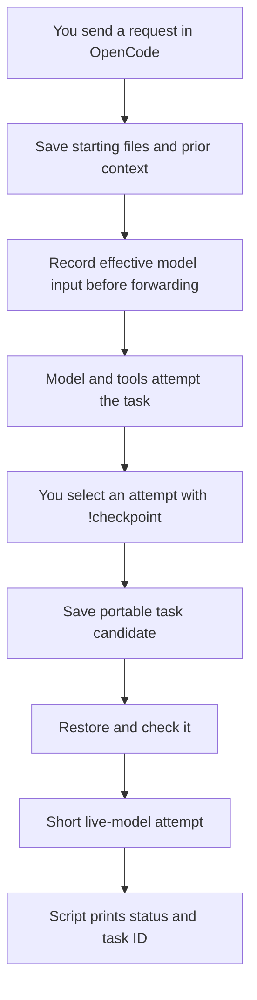
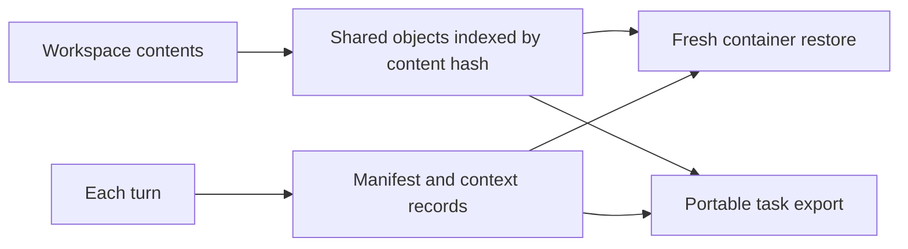
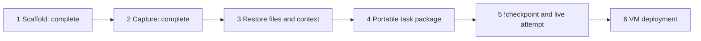

# MVP design

## Purpose and status

Create reproducible reinforcement learning (RL) task candidates from model attempts on normal software tasks. OpenCode is the interactive agent. The harness captures state, restores it, packages it, and checks that the agent can run. OpenRouter provides model access.

**Current position:** Steps 1 and 2 are complete. Step 3 is next. Restoration, portable packaging, and the checkpoint command are not yet verified. The agreed boundary is: Step 3 restores and compares; Step 4 packages for portability; Step 5 connects the user command and live attempt.

The first application is a quality audit of Xiaomi's public MiMo-V2.6 RL task dataset. Capturing that software work can produce additional task candidates. [Dataset](https://huggingface.co/datasets/XiaomiMiMo/MiMo-V2.6-RL-oss)

A working environment is not proof of a correct RL reward. A captured task remains a candidate until its task-specific success check is validated.

This document is editable. Use short, precise technical English. Detailed evidence belongs in the append-only agent-log.md. Requirement documents define each step's completion gate; this document explains the workflow.

## Normal use



Capture is automatic. A user turn is one request and its resulting attempt. A checkpoint identifies the starting state before that request. The original response and later tool actions are retained as evidence, outside the restored starting context.

`!checkpoint` defaults to the most recent eligible request in the active session. An explicit selector can choose an earlier request. The checkpoint command itself is not a task request. No global newest-session selection is permitted.

## Storage and isolation



Unchanged file contents reuse stored objects. New or changed contents add objects. Manifests preserve paths, file types, permissions, and link targets. Context and effective request records preserve the selected input. Storage grows with unique changes and retained context; there is no automatic deletion policy.

Each restore has a private writable workspace and OpenCode session store. The source capture store is read-only. Never use the live host workspace as the retry workspace.

The MVP covers one idle OpenCode session and one declared coding workspace. Process memory, live browser state, external service state, queued turns, and simultaneous sessions need separate capture rules.

## Build steps



| Step | Single output | Completion proof |
|---|---|---|
| 1 — Scaffold | Repository and capture test contract | Dependencies, fixture, version evidence, and test entry point exist. |
| 2 — Capture | Identified starting checkpoints | Frozen R1–R6 pass; real OpenCode capture and the optional live case have evidence. |
| 3 — Restore | Restore command and comparison reports | Two fresh containers reproduce the full workspace and effective input; negative fixtures fail. |
| 4 — Package | Portable task folder in the agreed layout | The folder contains all required data and restores without the original store. |
| 5 — User command | Working !checkpoint with deterministic confirmation | One command selects, packages, restores, checks, and makes a bounded real-model/tool attempt. |
| 6 — Deploy | Verified VM installation | The same workflow passes from a clean checkout on the selected VM. |

### Step 3 — Restore files and context

Use the existing capture store. Validate the selected checkpoint. Start a pinned Linux container and restore its files and prior conversation. Submit the selected request once. Intercept the first regenerated primary model request without forwarding it.

Check the complete restored workspace tree: required directories/files, bytes, permissions, link targets, and absence of deleted or unexpected entries. Compare instructions, ordered context, tool schemas, model settings, and declared path mappings. Restore twice to prove isolation. Invalid or incomplete state must fail clearly.

**Output:** a restore command, a pinned runtime definition, and structured comparison reports. No portable task package or live inference is required here.

**Requirements:** [Step 3](docs/step-3-requirements.md).

### Step 4 — Package the saved state

Put the selected saved state into a Harbor-shaped task folder. Include the objects, context, pinned environment references, and adapter metadata needed elsewhere. Validate the folder structure and object inventory.

Use Step 3's restore command to check the exported folder from a separate location with no access to the original store. Do not build a second restore implementation.

**Output:** a portable task candidate. This step does not connect !checkpoint or make live model calls.

**Requirements:** [Step 4](docs/step-4-requirements.md).

### Step 5 — Connect !checkpoint and prove it runs

Connect the active-session selection, Step 4 exporter, and Step 3 restore checks. Run a short low-cost model attempt through OpenRouter. Require a valid response and a real tool execution. Record a model substitution as a test override.

The script prints a fixed status and task ID. It keeps the saved package if checks or inference fail. A runtime smoke test must never claim that the task's reward is correct.

**Output:** the first complete user workflow.

**Requirements:** [Step 5](docs/step-5-requirements.md).

### Step 6 — Deploy

Document clean installation. Select a VM with the user. Keep provisioning separate from capture logic. Run the same capture, package, restore, and live-tool fixture there before the dataset audit starts.

**Output:** installation instructions and remote acceptance evidence. Freeze the provider-specific requirements before this step begins. Scripted batches follow deployment; start with 10–20 trials before increasing concurrency.

## Package layout

```text
<task-id>/
  instruction.md
  task.toml
  environment/Dockerfile
  capture/                 # custom extension: checkpoint, objects, adapter/runtime locks
  evidence/                # original attempt; excluded from active agent context
  tests/test.sh            # explicit runtime check or validated task verifier
```

This is a Harbor-shaped candidate with our capture extension. Harbor defines instruction, configuration, environment, and verifier components. Our adapter handles OpenCode restoration. A generic runtime check is not a task-success reward. Native Harbor evaluation compatibility must not be claimed from folder names alone. [Harbor task format](https://docs.harborframework.com/tasks/overview)

## Rules for implementation and review

1. Read this design, the current step's requirements, and the agent-log rules.
2. Execute only the requested step. For “next step”, use the current verified handoff. Do not restart completed steps.
3. Reuse the previous step's implementation and tests. Do not duplicate restore or comparison logic.
4. Each requirement has evidence and a completion result. A finding blocks completion only if it violates that step's stated requirement. New requirements need user approval.
5. Use isolated fixtures and project configuration. Do not inspect personal sessions or change global OpenCode settings.
6. Never store credentials in Git, reports, or task packages. Keep generated data under ignored work/.
7. Use real OpenCode and real containers for required integration evidence. Unit tests and controlled provider responses supplement that evidence.
8. Missing prerequisites are BLOCKED, not PASS. Preserve evidence; append verified results and citations to agent-log.md.
9. End with a short status, evidence location, and next step. A passing test count alone does not establish completion.

## Live-test budget

The user-approved spending cap is $0.10. The optional live-capture test accepts this key limit. Free-model selection remains enforced.
